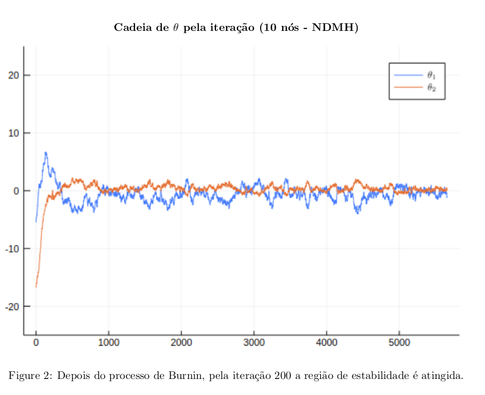
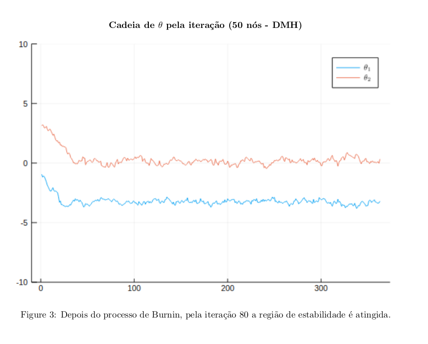

<h1> Estatística Computacional</h1>

Curso de Estatística Computacional na EMAp/FGV

O curso é similar ao que está contido no link abaixo:

http://www.stats.ox.ac.uk/~rebeschi/teaching/AdvSim/18/index.html

Esse repositório é composto por:

<ul>
  <li>1 pasta contendo os artigos utilizados para o trabalho (<b>artigos</b>).</li>
<li>1 pasta contendo as imagens utilizadas para o notebook, apresentação e relatório final (<b>imgs</b>).</li>
<li>1 pasta com os notebooks utlizados (<b>notebooks</b>).</li>
<li>1 pasta com a apresentação (<b>aprs</b>).</li>
<li>1 pasta com o relatório final do projeto de replicação (<b>relatorio</b>).</li>
  <li>1 pasta com as listas do curso (<b>listas</b>). </li>
</ul>

<h4>Trabalho Final</h4>

O tema do trabalho final escolhido para o curso realizado em 2019, foi a análise Bayesiana de modelos de grafos aleatórios exponenciais com base em dois métodos diferentes: O Double Metropolis Hastings e o Noisy Double Metropolis Hastings. Para a elaboração do trabalho foram
utilizados como referências dois artigos principais:

<ul>
  <li>Bayesian Inference in the Presence of Intractable Normalizing Functions (Jaewoo Park e Murali Haran)</li>
  <li>Bayesian Analysis for Exponential Random Graph Models Using the Double Metropolis-Hastings Sampler (Ick Hoon Jin e Faming Liang)</li>
</ul>

<h4>Sobre os Códigos</h4>

 Inicialmente os código foram feitos em Python 3.7, pela demora que estava tendo para executar os códigos, foi necessária uma linguagem mais apropriada para simulação, isto é, uma linguagem de mais baixo nível. A linguagem Julia antendeu aos requisitos necessários e conseguiu diminuir o tempo de execução do código em 5 vezes que aquele tempo originalmente feito em Python. Está tudo disponibilizado acima nas pastas.

<h4>Noisy e Double Metropolis Hastings (NDMH e DMH)</h4>

O método de Double Metropolis Hastings é bastante similar ao do Metropolis Hastings original. A con-
  tribuição do DMH reside na introdução de uma variável auxiliar que termina por aumentar o espaço-estado
  da cadeia de Markov original. Isto posto, o nome do método surge simplesmente pelo fato de que a atual-
  ização da variável auxiliar é realizada mediante uma quantidade de passos pré determinadas composta por
  um outro Metropolis Hastings.

Vale observar que alguns parâmetros podem ser escolhidos de maneira que o resultado seja o melhor. Um
  exemplo seria o próprio número de passos m, cujo valor costuma ser proporcional ao tamanho do dado
  (resultado heurı́stico). Para o caso das redes, veremos que esse número de passos será equivalente a atu-
  alização de cada elemento da matriz e assim o número de passos totais resultante deste procedimento é o
  próprio tamanho da matriz de adjacência do grafo em questão. Outro ponto ainda sobre o valor de m reside
  no fato de que como o DMH (e consequentemente o NDMH como veremos mais a frente) é um algoritmo
  assintóticamente inexato uma vez que a condição de balanceamento detalhado não funciona para o primeiro
  Metropolis-Hastings sem que o segundo possua um m suficientemente grande, e desta maneira precisamos
  escolher esse valor com uma magnitude elevada. Isto implica dizer que para redes pequenaas o procedimento
  não consegue fornecer uma aproximação tão boa quanto para redes maiores.

Se um kernel de transição de uma cadeia de Markov atende a condição de balanceamento detal-
  hado com respeito a função de target, então ela é uma cadeia assintóticamente exata. Quando aproximamos
  esse kernel de transição por outro, as amostras geradas apenas se assemelharão a aproximação da tar-
  get anterior. Esse tipo de estratégia compõem aquilo que denota-se por ”Noisy MCMC”. Nestes métodos
  procuram-se distâncias variacionais de modo que conseguimos determinar quando a técnica se qualifica como
  assintóticamente exata ou inexata. Esses métodos de Noisy costumam ser analisados como um hı́brido de
  métodos de aproximação de likelihood com métodos de variáveis auxiliares. O método de Noysi Double
  Metropolis-Hastings utilizado é considerado um método assintóticamente inexato e suas principais modi-
  ficações realizados no DMH associam-se a introdução de muitas variáveis auxiliares no procedimento de
  ”Inner Sample”.

<h4>Aplicação e Resultados</h4>

Gerar uma rede exponencial aleatória não é uma tarefa fácil. Entretanto, assumimos que dado algum exemplo
  poderı́amos estimar via pacotes já implementados no R o valor das constantes dos modelos dessas redes, com
  a aplicação do Markov Chain Monte Carlos Maximum Likelihood Estimator (MCMCMLE), algoritmo este
  que foi utilizado no segundo artigo do trabalho final.

Para a realização da aplicação dos algoritmos acima, procuraram-se duas redes, uma com 10 nós,
  extraı́das da base ”Florentine” do R, e uma rede com 50 nós gerada no R, mas sem ser necessariamente
  exponencial, isto é, apenas consideramos que era, por hipótese, e comparamos o seu valor com o obtido
  pelo método de MCMCMLE. Desta maneira poderı́amos avaliar tais algoritmos para um dado modelo de
  rede, modelo este que foi o segundo, pois como mencionado em seções anteriores, possui duas estatı́sticas
  suficientes diferentes.
]

O quadro comparativo entre os métodos pode ser visto a seguir:

Os gráfico obtidos pelas simulações descritas estão disponibilizados abaixo.

Maiores informações verificar o pdf com o conteúdo completo das análises do trabalho final (na pasta <i>relatório</i>)

